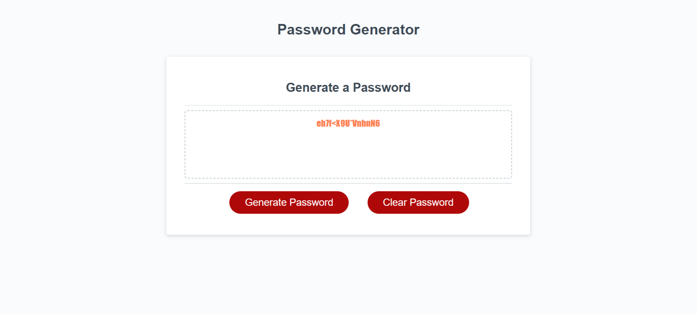

# Create-a-PW

<h1>Create-A-Password!</h1>

<h2>Here, you will find a handy password generator of up to 128 characters you can choose to your liking!</h2>
<h3>Attached you will find an example on how the page will appear</h3>

<h2>Link to Repo:  <a href="https://github.com/khernandez0810/Create-a-PW">https://github.com/khernandez0810/Create-a-PW</a>
<h2>Link to Deployed application:  <a href="https://khernandez0810.github.io/Create-a-PW/">https://khernandez0810.github.io/Create-a-PW/</a>
